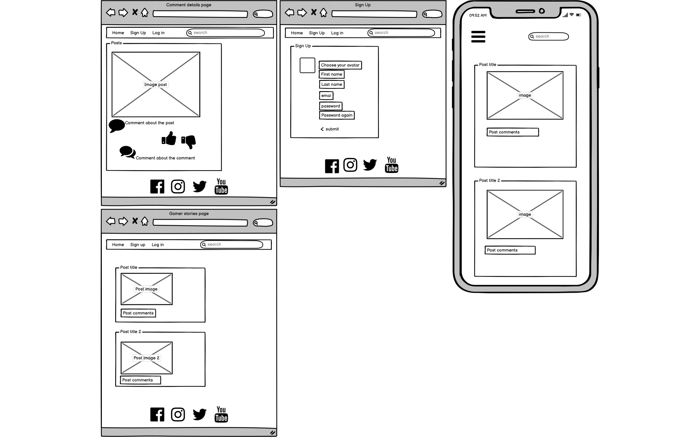

# Gamer Stories

## Contents

### 1. Introduction

### 2. UX

- User Goals

- Creator Goals

- Development Plans
 
I. Strategy

II. Scope

III. Structure

IV. Skelton

V. Surface

### 3. Features

### 4. Issues

### 5. Technologies

#### Languages used:

### 6. Testing

### 7. Deployment

### 8. Credits

# Gamer Stories

## Gamer stories is a blog targeting peoples who love video games. Could be anyone who plays or watch or read or make games, it is all about games. It is a place where stories can be shared with others. Talk about the latest video game releases or experiences from your favourite games.

## User Goals:

### 1. First time visitor:

### 2. Returning visitor:

## Creator Goals:

- User friendly site

- screen responsive on all devices

- to build a community and share passion about games

## UX

IV. Skelton 

Balsamiq wireframe for windows and mobile screen

### 5. Technologies

- Django frame

- Bootstrap 4

- Font Awesome:

Icons from each page were taken from font awesome

- Google fonts

Google fonts were used to import Dongle font into style.css

- Multiavatar

[Multiavatar](https://multiavatar.com/)

- Git

Git was used for version control

- Github

to store the project code

- Heroku

- Wireframe

Balsamiq wireframe

- Coolors

Find colors from a wide selection

[Coolors](https://coolors.co/9f9aa4-e7cfcd-536565-b5c9c3-cab1bd)
