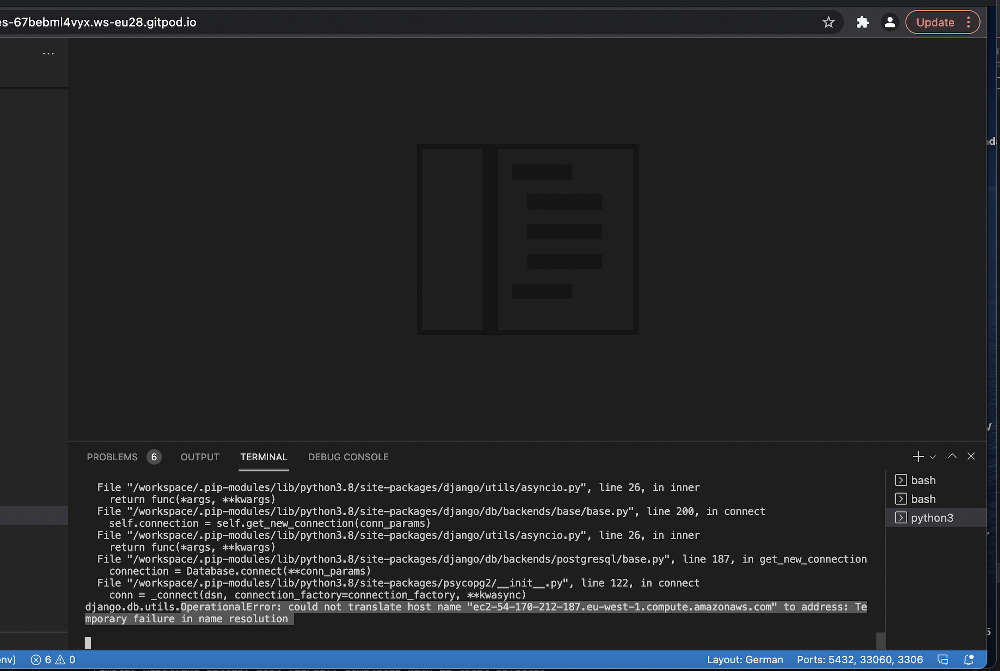

# Gamer Stories

## Contents

### 1. Introduction

### 2. UX

- User Goals

- Creator Goals

- Development Plans
 
I. Strategy

II. Scope

III. Structure

IV. Skelton

V. Surface

### 3. Features

### 4. Issues

### 5. Technologies

#### Languages used:

### 6. Testing

### 7. Deployment

### 8. Credits

# Gamer Stories

## Gamer stories is a blog targeting peoples who love video games. Could be anyone who plays or watch or read or make games, it is all about games. It is a place where stories can be shared with others. Talk about the latest video game releases or experiences from your favourite games.

## User Goals:

### 1. First time visitor:

- A gamer blog website what is easy to use

- A gamer blog website where the user can share their thoughts

- A gamer blog website where the user can connect with other pasionet gamers

### 2. Returning visitor:

- A gamer blog website where they can come back to share their stories with in a daily bases

- A gamer blog website where they have fun

## Creator Goals:

- User friendly site

- screen responsive on all devices

- to build a community and share passion about games

- connect people

## UX

I. Strategy

#### The focus of the blog:

Target audience:

- anyone who love video games

- new and returning bloggers

Demographics:

- age is not relevant

Psyhographics:

- playing games is a lifestyle

- people who want to join a gamer community

- play together

- talk about games

II. Scope

User requirements:

- Sign up or log in to the site by providing username and password

- post a comment

- edit or delete a comment

- like or dislike a comment

Admin requirements:

- has all the functionality as a user

- approve comments

- delete comments

III. Structures

#### Organization of structure:

Home page, new comment page, account page. 

IV. Skelton 

Balsamiq wireframe for windows and mobile screen

### 3. Features

Existing features:

On all pages :

- navbar

- sign in and out options

- On Comment page:

- logged in users can comment and like 

- from main page users can register, log in

#### Features to implement:

- create a post as a user:

- modify and delete a post as a user

- avatars can be selected when user is making registration

- user can upload pictures

- search functionate

### Issues

Solved issues

- gitpod crash on my project

Tutor service was helping to solve the problem, which was coming from gitpod servers. Continuisly recieved error messages when i run the server, error messages of vs code and python is not installed.

- pagination issue

Empty page error

I run into that bug after implementing the createview feature in my views. I got the error message after loading the page in, the error came from the pagination, in models.py where the pagination number was given, that was causing the problem, it was to small, changed that for bigger number and than the bug was solved.

Known issues and bugs to be solved

- page not found

After implementing the createview function, so users could post too, this error came up, after as a user logged in and tried to create a new post. Still working on this bug to solve it, tried to find it on [stackoverflow](https://stackoverflow.com/questions/60590738/the-current-path-post-didnt-match-any-of-these)
but unfortunately i could not solve this bug yet. 

- alert message

Alert messages for notifications to the users, the message itself is showing and fading just as planned, but the box style is not displaying

- no reverse match

whne created the createview, after adding the urls and template, my plan was to import the new poststorie model to the blog view and render everything on the main page, but i got this error message. After trying many options, what i could read and find on[djangoproject](https://docs.djangoproject.com/en/4.0/topics/class-based-views/generic-display/) and contacted tutor service to try to find where the problem is.

### Technologies

#### Languages used:

- HTML

- CSS

- JavaScript

- Python

#### Frameworks and libraries

- Django framework 

- Bootstrap 4

- Font Awesome:

Icons from each page were taken from font awesome

- Google fonts

Google fonts were used to import Dongle font into style.css

- Multiavatar

[Multiavatar](https://multiavatar.com/)

- Git

Git was used for version control

- Github

to store the project code

- Heroku

heroku was used to deploy the website

- Wireframe

Balsamiq wireframe to create the wireframe

- Coolors

Find colors from a wide selection

[Coolors](https://coolors.co/9f9aa4-e7cfcd-536565-b5c9c3-cab1bd)

- DBD diagram

dbd diagram was used to create the diagram

### 6. Testing

- HTML testing

[html_validator](https://validator.w3.org/#validate_by_input)

- CSS validator

[css_validator](https://jigsaw.w3.org/css-validator/)

- PEP8 

[pep8](http://pep8online.com/)

#### Manual testing:

Hero Image 

Opening part with hero image, navbar with home, new post and log in/out options
Search button

Blog area

This is the blog area where the new posts will come up, ordered by time,date. Lateset come first. Pioctures are the same right now, because the uploding is still not implemented, it is mentioned in the feature implementing section.

Comment area 

Here one of the comment is opened, where the likes the posted date and the user who posted visible, under there is a comment section where other people can post something to this post

Sign in page

Sign in page, the log out and the register is also available.

New looks of the page

Added update and delete options

Create a new post as a user

New post available from the navbar, registered user can create a post, where all other users can comment

Update a post

Update page, where user can update the post

Delete a post

Delete page, where user can decide to delete the post

### Deployment

The Blog project was developed using gitpod, committed to Git and stored at GitHub.

Deployed on heroku because of the python application.

The steps of the deployment:

- first created an app on Heroku: select new, choose a name and create new app

- in heroku settings => revael config vars=> : added 
DATABASE_URL, SECRET_KEY, CLOUDINARY_URL

- click on deploy

- next step is to click on connect on the selected repository from github

- click deploy branch, and enable automatic deployment

- in gitpod created env.py, where added the following variables:

1. DATABASE_URL
2. SECRET_KEY
3. CLOUDINARY_URL

- created requirements.txt

### Credits

1. The CodeInstitue 'I think Therefore I Blog' video was used as the main reference point how to set up a blog application.

2. Pagination code was used from bootstrap

3. Usplash for the images

[usplash](https://unsplash.com/)

4. Stackoverflow 

[stackoverflow](https://stackoverflow.com/)

- to look solutions and advices on errors and bugs

5. My mentor for the feedbacks on the project 

6. Code Institute tutor support for their help and support with the crash on my project

